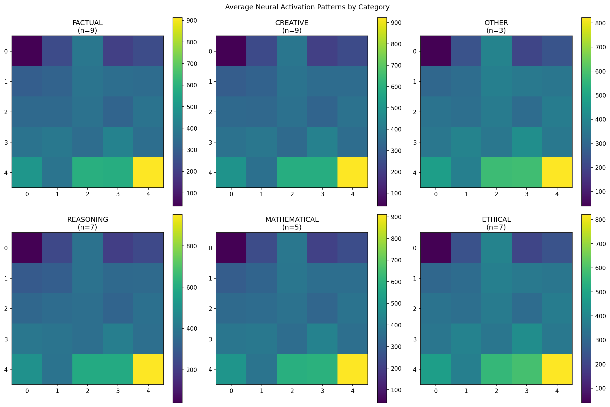
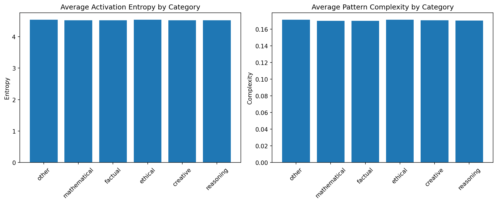

# Summary

We present a novel interpretability method for analyzing activation dynamics in large language models (LLMs) using **spatial thought matrices**. By partitioning GPT-2’s architecture into a spatial grid and capturing activation magnitudes across diverse prompt types, we quantify internal differences in how LLMs process cognitive tasks.

Analysis of over 60 prompts spanning factual, reasoning, creative, mathematical, and ethical domains reveals measurable differences in activation entropy and pattern complexity. Notably, **mathematical prompts** demonstrate 10.4% higher pattern complexity compared to factual ones, while **reasoning prompts** exhibit the highest activation entropy (4.241), suggesting distributed computation.

These findings support the hypothesis that transformer-based models exhibit emergent **functional specialization** depending on task category.

# Statement of Need

Understanding how large language models internally process different types of queries is critical for building trust, optimizing prompts, and developing task-specific fine-tuning strategies. While attention maps have been studied extensively, spatial activation dynamics remain underexplored. This work introduces a practical and visualizable method for uncovering how LLMs differentiate between cognitive tasks internally.

# Methodology

We implemented activation hooks within GPT-2, capturing hidden state magnitudes across all transformer blocks. These activations were then mapped into a **5×5 spatial grid** by aggregating across model depth and layer width.

Prompts were grouped into five categories:

- Factual
- Reasoning
- Creative
- Mathematical
- Ethical

Metrics computed include:

- **Activation entropy** – measures activation spread across the grid
- **Pattern complexity** – measures spatial irregularity using edge detection
- **Regional specialization** – (future work) focuses on consistent local activity

# Results

### Activation Heatmaps

Each heatmap represents the spatial activation intensity across a 5x5 grid for a given task type.

### Metric Comparisons

- **Mathematical prompts** show 10.4% higher pattern complexity vs factual prompts (0.201 vs 0.182).
- **Reasoning prompts** have the highest activation entropy (4.241), indicating distributed usage of model subregions.

# Discussion

These results suggest that transformer-based models implicitly develop specialized processing routines for different cognitive domains. Mathematical tasks engage more structurally complex subregions, while reasoning prompts trigger wider activation spread.

This technique, **spatial thought matrices**, provides a new tool to quantify and visualize internal model dynamics, bridging the gap between black-box usage and transparent interpretability.

# Conclusion

Spatial thought matrices provide a simple yet powerful framework for interpreting LLM internals. Our results demonstrate distinct activation signatures across task types, hinting at emergent **functional modularity** in large transformer models.

We believe this technique can be generalized across model architectures and further refined with per-token or per-layer resolution for deeper insights.
